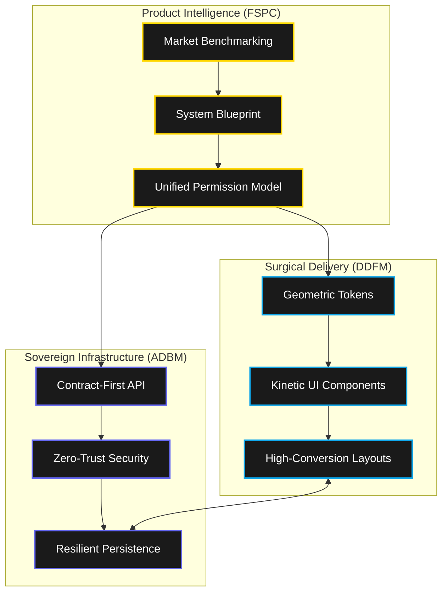

# Sovereign AI Manifestos 🔱
## The Definitive Introduction to Autonomous Engineering Excellence

Welcome to the **Sovereign AI Manifestos**. This repository is not a collection of boilerplate; it is an **Operating System for Autonomous Intelligence**. These manifestos were forged to solve a single problem: *How do we move AI agents from generating code to architecting commercial-grade products?*

---

## 🔱 The Trinity: Defining the Skills

Behind every world-class product generated by this framework lie three primary "Sovereign Skills." Each is a self-contained manifesto of engineering principles, refined for high-density AI execution.

### 🛡️ 1. API-Driven Backend Manifesto (ADBM)
*The Sovereign Foundation*
**Path**: `./skills/api-driven-backend-manifesto`

ADBM elevates backend engineering from a technical task to an **Architectural Mandate**. It ensures that every service is born with enterprise-grade resilience and data sovereignty.

- **Infrastructure Sovereignty**: Moves security from the code to the data level using **Mandatory Row-Level Security (RLS)** and RBAC.
- **Zero-Trust Defaults**: Every endpoint is a hardened gate. All outbound communications follow the **Sovereign Webhook Protocol** (Signed, Idempotent, Resilient).
- **Engineering Rigor**: Codifies **P95 < 100ms** latency and automated circuit breakers as non-negotiable standards.

### 🎨 2. Design-Driven Frontend Manifesto (DDFM)
*The Surgical UI Experience*
**Path**: `./skills/design-driven-frontend-manifesto`

DDFM is high-fidelity artistry powered by mathematical precision. It rejects "generic" UI in favor of **Aesthetic Sovereignty**—interfaces that feel alive, precise, and premium.

- **Surgical Precision**: Every component is built with **0.5px accuracy** and geometric harmony derived from the **Golden Ratio (Phi)**.
- **Kinetic Life System**: Replaces rigid transitions with **Spring Physics Motion**. UI elements respond with biological fluid dynamics to user intent.
- **Perceptual Excellence**: Uses **OKLCH Color Theory** to ensure brand consistency across all hardware displays and lighting conditions.

### 🚀 3. Full-Stack Product Commander (FSPC)
*The Strategic Orchestrator*
**Path**: `./skills/full-stack-product-commander`

FSPC is the brain of the ecosystem. It is a **full-lifecycle product manager** that coordinates ADBM and DDFM to deliver products that are not just functional, but **Market-Competitive**.

- **Market Intelligence**: Before a single line of code is written, FSPC autonomously benchmarks against industry leaders (e.g., Stripe, Linear, Airbnb) to define a world-class feature set.
- **Business Loop Mastery**: Ensures every feature has a **Value Trigger**. Features are never "dead-ends"; they always lead to monetization hooks, analytics events, or persistent state.
- **The 100% Audit Protocol**: A mandatory protocol that rejects any deliverable scoring below **95/100**. It enforces "Zero Placeholder" delivery.

---

## 🏗️ Architectural Synergies

---

## 🔱 Why Sovereign AI?

In an era of generic AI code generation, **Sovereign AI** stands for **Quality as a First-Class Citizen**. By adopting these skills, you enable an agent to produce software that is:
1.  **Commercial-Ready**: Deployment-hardened on day one.
2.  **Surgical in Detail**: Aesthetic quality that rivals top-tier design studios.
3.  **Sovereign in Structure**: Secure, scalable, and independent.

---
> **"Engineering is the art of making what is possible, reliable."**  
> We don't just build code; we command digital sovereignty. 🔱
