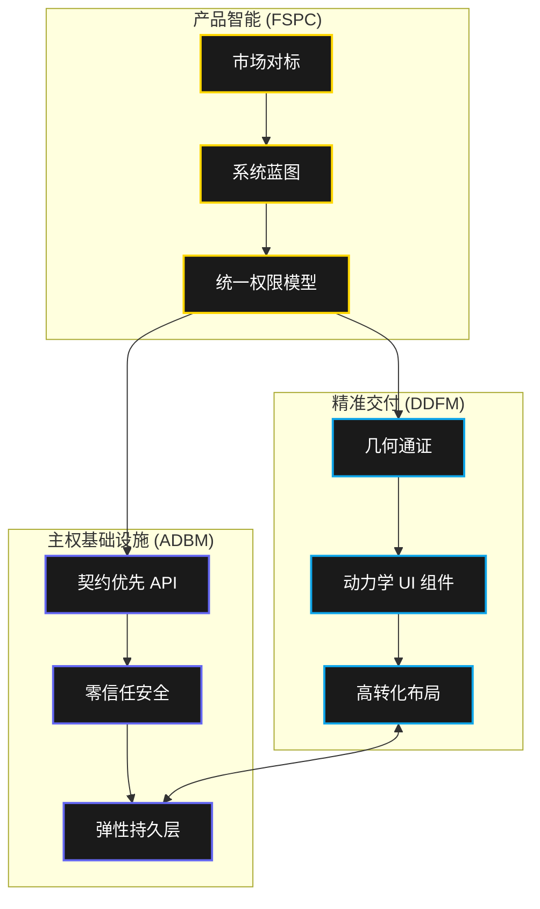

# Sovereign AI Manifestos 🔱
## 自主工程卓越性的终极指南

欢迎来到 **Sovereign AI Manifestos**（主权 AI 宣言）。该仓库并非普通的样板代码集合，而是一套 **自主智能体的操作系统**。这些宣言的诞生旨在解决一个核心问题：*我们如何让 AI 智能体不仅能生成代码，更能架构出商业级的产品？*

---

## � 三位一体：定义核心技能

在此框架生成的每一个世界级产品背后，都由三大“主权技能”支撑。每一个都是经过提炼的工程原则宣言，专为高密度 AI 执行而生。

### 🛡️ 1. API 驱动后端宣言 (ADBM)
*主权基石*
**路径**: `./skills/api-driven-backend-manifesto`

ADBM 将后端工程从单纯的技术任务提升为 **架构指令**。它确保每一个服务的诞生都具备企业级的韧性和数据主权。

- **基础设施主权**: 通过 **强制行级安全 (RLS)** 和 RBAC，将安全性从代码层下沉至数据层。
- **零信任默认**: 每一个端点都是一道坚固的闸门。所有出站通信均遵循 **主权 Webhook 协议**（签名、幂等、弹性）。
- **工程严谨性**: 将 **P95 < 100ms** 的延迟标准和自动熔断机制编纂为不可妥协的铁律。

### 🎨 2. 设计驱动前端宣言 (DDFM)
*手术刀级的 UI 体验*
**路径**: `./skills/design-driven-frontend-manifesto`

DDFM 是由数学精度驱动的高保真艺术。它拒绝“平庸”的 UI，推崇 **审美主权**——创造出鲜活、精准且具备高级感的界面。

- **手术刀精度**: 每一个组件都以 **0.5px 的精度** 构建，并遵循源自 **黄金比例 (Phi)** 的几何和谐。
- **动力生命系统**: 摒弃生硬的过渡，采用 **弹簧物理动效**。UI 元素能够以生物流体动力学响应用户的意图。
- **感知卓越性**: 运用 **OKLCH 色彩理论**，确保品牌在所有硬件显示和光照条件下的一致性。

### 🚀 3. 全栈产品指挥官 (FSPC)
*战略编排者*
**路径**: `./skills/full-stack-product-commander`

FSPC 是整个生态系统的大脑。它是一位 **全生命周期产品经理**，协同 ADBM 和 DDFM，交付的不仅是功能，更是 **具备市场竞争力** 的产品。

- **市场情报**: 在写下一行代码之前，FSPC 会自主对标行业领袖（如 Stripe, Linear, Airbnb），定义世界级的功能集。
- **商业闭环掌控**: 确保每一个功能都有 **价值触发点**。功能绝不是“死胡同”，它们总是通向变现钩子、分析事件或持久化状态。
- **100% 审计协议**: 一项强制协议，拒绝任何得分低于 **95/100** 的交付物。它强制执行“零占位符”交付。

---

## 🏗️ 架构协同效应

---

## � 为什么选择 Sovereign AI？

在通用 AI 代码生成泛滥的时代，**Sovereign AI** 坚持 **质量即一等公民**。通过采用这些技能，您赋予了智能体生产如下软件的能力：
1.  **商业就绪**: 发布的瞬间即已通过实战淬炼。
2.  **细节入微**: 媲美顶尖设计工作室的审美质量。
3.  **结构主权**: 安全、可扩展且独立。

---
> **"工程是将可能变为可靠的艺术。"**  
> 我们不止于构建代码；我们统御数字主权。 🔱
