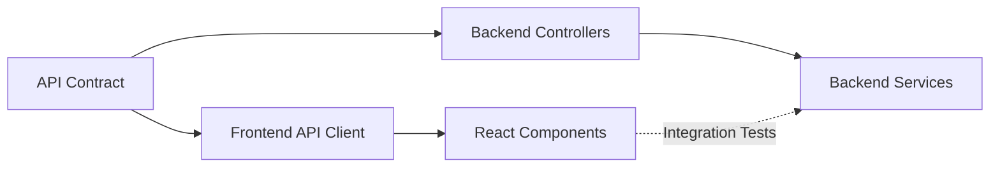

# Project Planning Template

*Use this template for all FSPC project plans*

---

# [Product Name] - Project Plan

## 🎯 Project Overview

**Product**: [Product name]  
**Goal**: [One-sentence goal from product brief]  
**Timeline**: [X days/weeks]  
**Team**: Full-Stack Product Commander (AI)

---

## 🏗️ Tech Stack Decision

### Frontend
- **Framework**: [React/Vue/Next.js] + [Vite/Next]
- **UI Library**: [Tailwind/MUI/Custom]
- **State Management**: [Redux Toolkit/Zustand/Pinia/React Query]
- **Aesthetic**: [Minimalist/Industrial/Editorial/Biophilic]
- **Testing**: [Vitest + Testing Library]

**Rationale**: [Why this stack? Based on DDFM decision engine]

### Backend
- **Architecture**: [Serverless/Modular Monolith/Microservices]
- **Framework**: [NestJS/FastAPI/Go]
- **Database**: [PostgreSQL/MySQL/Supabase]
- **ORM**: [TypeORM/Prisma/SQLAlchemy/GORM/MyBatis Plus]
- **Cache**: [Redis]
- **Auth**: [JWT + Passport/FastAPI Security]
- **Testing**: [Jest/Pytest/Go test]

**Rationale**: [Why this stack? Based on ADBM decision engine and scale]

### Infrastructure
- **Development**: Docker Compose
- **Deployment**: [Vercel + Railway / AWS / GCP / Self-hosted]
- **Monitoring**: Prometheus + Grafana
- **CI/CD**: GitHub Actions

---

## 📅 Timeline Breakdown

| Phase | Duration | Tasks | Deliverables |
|-------|----------|-------|--------------|
| **Phase 1: Foundation** | Day 1-2 | API contract, DB schema, project setup | `api-contract.yaml`, migrations |
| **Phase 2: Frontend** | Day 3-6 | DDFM generation, components, routing | `frontend/` directory |
| **Phase 3: Backend** | Day 3-6 | ADBM generation, controllers, services | `backend/` directory |
| **Phase 4: Integration** | Day 7-9 | API integration, E2E tests | Working full-stack app |
| **Phase 5: QA & Deploy** | Day 10-12 | Performance, security, deployment | Production-ready package |
| **TOTAL** | **12 days** |

### Detailed Daily Plan

**Day 1**:
- Generate OpenAPI contract from user stories
- Design database schema (ERD)
- Initialize frontend + backend repos

**Day 2**:
- Finalize API contract
- Create database migrations
- Set up Docker Compose

**Day 3-4**:
- **Frontend**: DDFM generates React/Vue components
- **Backend**: ADBM generates NestJS/FastAPI services
- (Parallel development)

**Day 5-6**:
- **Frontend**: Routing, state management, API client
- **Backend**: Auth, validation, caching

**Day 7-8**:
- Integration: Connect frontend to backend
- Fix API contract mismatches
- Write E2E tests for critical flows

**Day 9**:
- Performance optimization (lazy loading, query optimization)
- Security audit (inputs, auth, HTTPS)

**Day 10-11**:
- Load testing (target: 1000 RPS)
- Accessibility audit (WCAG 2.1 AA)
- Documentation (README, deployment guide)

**Day 12**:
- Final testing
- Production deployment
- Handoff to user

---

## 📊 Effort Estimation

### Complexity Assessment
| Component | Complexity | Justification |
|-----------|------------|---------------|
| **Frontend** | [Low/Medium/High] | [Number of pages, components, interactions] |
| **Backend** | [Low/Medium/High] | [Number of entities, endpoints, business logic] |
| **Database** | [Low/Medium/High] | [Number of tables, relationships] |
| **Integrations** | [Low/Medium/High] | [External APIs, webhooks] |

### Time Estimates (Auto-calculated)
```
Frontend: [X] days
Backend: [Y] days  
Integration: [Z] days
Testing: [T] days
Deployment: 1 day
────────────────────
TOTAL: [X+Y+Z+T+1] days
```

---

## ⚠️ Risk Assessment Matrix

| Risk | Likelihood | Impact | Mitigation Strategy |
|------|------------|--------|---------------------|
| **Scope Creep** | High | High | Lock MVP features in product brief, defer V1/V2 |
| **API Contract Mismatch** | Medium | High | Generate contract first, validate both sides |
| **Performance Issues** | Low | Medium | Follow DDFM/ADBM performance budgets |
| **Timeline Overrun** | Medium | Medium | Include 20% buffer, daily progress tracking |
| **Database Schema Changes** | Medium | Medium | Use migrations, avoid breaking changes |
| **Third-Party API Failures** | Low | High | Circuit breakers, graceful degradation |

---

## 🔗 Dependencies & Coordination Points

### Frontend ↔ Backend Dependencies



**Critical Coordination Points**:
1. **Day 1-2**: API contract must be finalized before frontend/backend work begins
2. **Day 5**: First integration test - validate contract compliance
3. **Day 7**: Full E2E testing begins

### External Dependencies
- **Third-party APIs**: [List APIs, SLA, fallback strategy]
- **Design assets**: [Logo, images - must provide by Day 3]
- **Content**: [Copy, translations - must provide by Day 5]

---

## 📦 Deliverables Checklist

### Code Artifacts
- [ ] `product-brief.md` - Product requirements
- [ ] `project-plan.md` - This document
- [ ] `api-contract.yaml` - OpenAPI specification
- [ ] `frontend/` - Complete frontend application
- [ ] `backend/` - Complete backend service
- [ ] `docker-compose.yml` - Local development setup
- [ ] `tests/integration/` - E2E tests

### Documentation
- [ ] `README.md` - Project overview + quick start
- [ ] `deployment-guide.md` - Production deployment steps
- [ ] `qa-report.md` - Test results, performance validation
- [ ] API documentation (Swagger UI)

### Quality Gates
- [ ] Frontend: DDFM audit > 100/120
- [ ] Backend: ADBM audit > 130/140
- [ ] E2E tests passing (>80% coverage of critical flows)
- [ ] Performance: P95 < 100ms, LCP < 2.5s
- [ ] Security: No critical vulnerabilities
- [ ] `docker-compose up` works

---

## 📈 Success Metrics Tracking

### Development Metrics
- **Velocity**: [Features completed per day]
- **Code Quality**: [Linter errors, test coverage]
- **Performance**: [P95 latency, bundle size]

### Post-Launch Tracking
- **Product Metrics**: MAU, retention, task completion (from product brief)
- **Technical Metrics**: Uptime, error rate, API latency
- **UX Metrics**: Time to value, NPS

**Monitoring Setup**:
- Front end: Google Analytics + Web Vitals
- Backend: Prometheus + Grafana
- Errors: Sentry / LogRocket

---

## 🚀 Deployment Strategy

### Environments
1. **Local**: Docker Compose
2. **Staging**: (Optional) - Same as production
3. **Production**: [Platform details]

### Rollout Plan
- **Day 12**: Deploy to production
- **Day 13-14**: Monitor metrics, fix critical bugs
- **Week 2**: Gather user feedback, plan V1

---

## 📞 Communication Plan

*Note: For AI execution, this is for transparency only*

- **Daily Updates**: Progress summary at EOD
- **Blockers**: Immediate notification if stuck
- **Scope Changes**: Flag and get approval before implementing

---

**Created by**: Full-Stack Product Commander  
**Date**: [Auto-generated]  
**Last Updated**: [Auto-generated]
